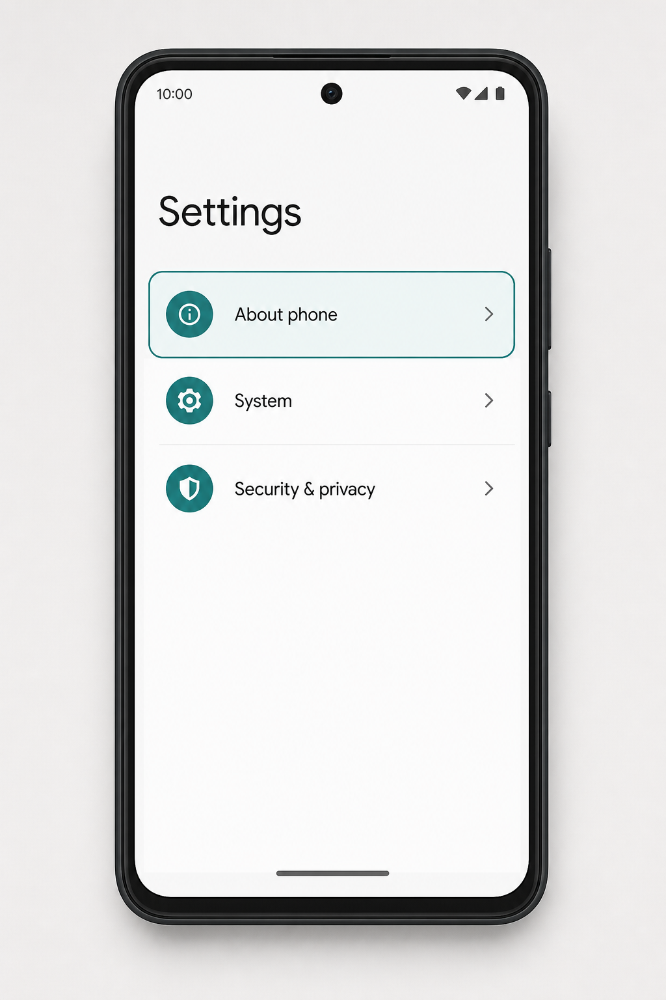
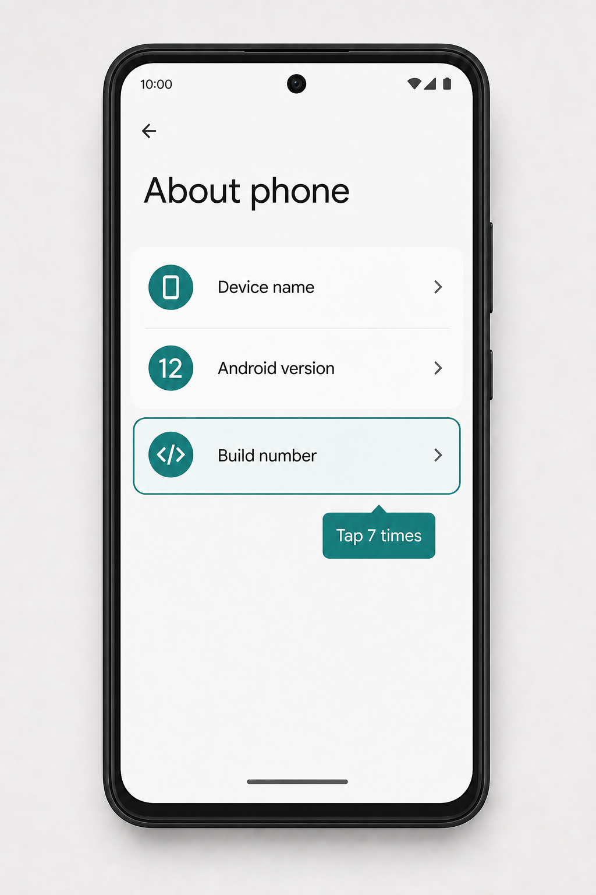
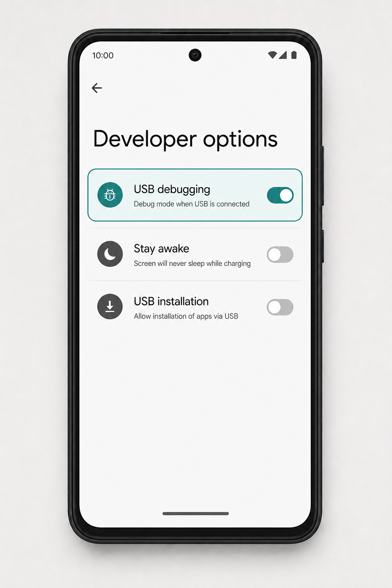
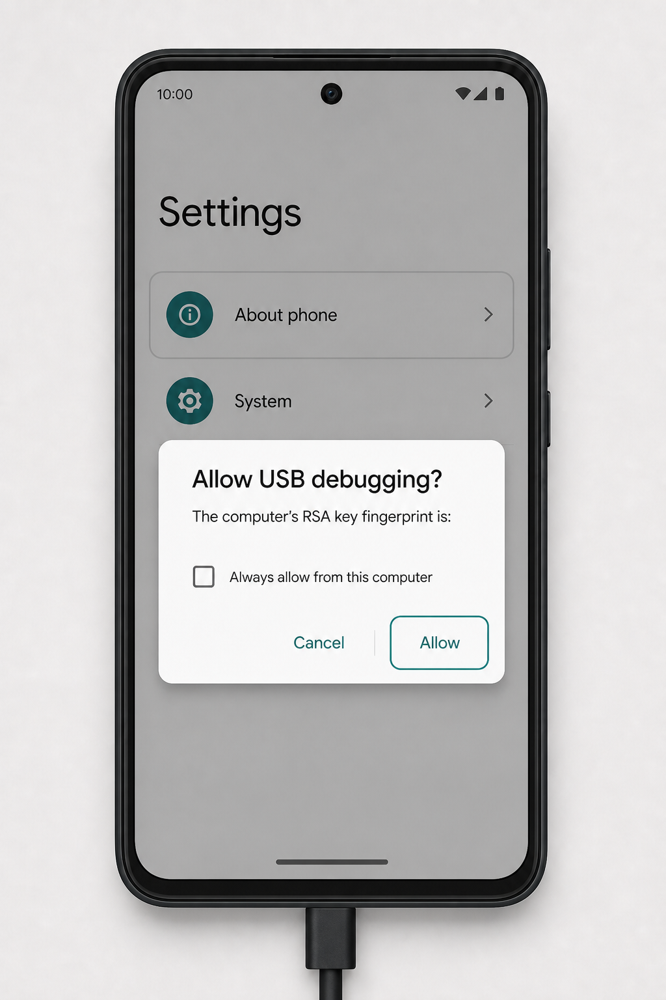

# JA ADB Tool User Guide

## 1. Connect an Android device

1. Install the USB driver supplied by the device manufacturer (or Google USB Driver).
2. Enable **Developer options → USB debugging** on the Android device.
3. Connect the device by USB and approve the RSA authorization prompt.
4. Select the device from the sidebar and use **Refresh** if it does not appear immediately.

For a Wi-Fi connection, open the sidebar **Wireless ADB** action, enter the device IP and port (normally `5555`), and select **Connect**. Saved endpoints can be reused from the same dialog. **Diagnostics** checks the local tools and active device; **Device Workspaces** stores the paths, endpoint, and sync folders needed to return to a known setup.

When no device is connected, JA ADB Tool shows the same setup as a four-step illustrated guide. The images are neutral Android-style examples; labels can differ by phone brand. Click any image in the app to open a zoomable preview.

## 2. Mirror the device screen

Open **Screen Mirror**, choose the desired Scrcpy options, and select **Launch Mirroring**. Save a named **Scrcpy Profile** beside the options to reuse a presentation, testing, or read-only setup. The bundled Scrcpy runtime is used by the Windows portable build.

## 3. Manage files

Use **File Explorer** to browse Android storage. Select files to upload, download, create folders, or delete. Batch operations show progress and transfer speed where available.

Open **App Manager** to search installed packages. Select multiple visible apps with the checkboxes, then use the batch action button to freeze, unfreeze, force-stop, or uninstall them. Uninstall requires an explicit confirmation and reports successes and failures separately.

## 4. Safe Sync v2

1. Open **Folder Sync** and choose a PC folder, Android folder, and direction.
2. Choose normal synchronization to copy/update files, or enable **Mirror Sync** to remove files that exist only on the target.
3. Select **Start Sync**. The app first displays a diff preview with copy/update/delete counts and the exact delete paths.
4. Review the preview. If deletions are present, type `DELETE` exactly in the confirmation field and select **Start Sync**.
5. If either folder changes after the preview, the operation stops safely and asks you to review a fresh diff.
6. During a long sync, use **Pause** to hold before the next file and **Resume** to continue. **Cancel** leaves the completed actions in the log.

Auto-sync is disabled while Mirror Sync is selected so a destructive operation cannot run without an explicit preview confirmation.

## 5. Install APK/XAPK

Open **App Installer** and select or drag an APK/XAPK file into the app. XAPK archives are checked for unsafe paths, symlinks, excessive entry counts, and oversized content before extraction.

## 6. Latest Media and Quick Tools

Use **Latest Media** to review recent photos/videos. **Quick Tools** provides text input, key simulation, reboot controls, screenshots, and other common ADB actions.

## 7. Reverse tethering

Configure the bundled Gnirehtet executable under **Paths Settings**, then start reverse tethering. Unlock the device and approve the VPN permission prompt shown by Android.

## 8. Settings, About, and Glassmorphism

Open **Settings** from the sidebar. The dialog contains three top-level tabs — **Advanced Settings** (default), **About**, and **User Guide** — without opening child dialogs. Tool Paths is collapsed by default; expand it only when you need to change ADB, Scrcpy, or Gnirehtet locations. The selected app language is saved and restored on the next launch. The **Glassmorphism** section in Advanced Settings includes a live preview and four sliders:

- Main background blur and opacity
- Dialog blur and opacity

Slider changes remain local until **Save** is pressed. **Default** restores the factory values (10px / 60% for the main background and 12px / 75% for dialogs); **Cancel** discards the preview. When a surface is translucent, the preview keeps a minimum 6px blur to preserve text legibility.

Press **Ctrl+K** anywhere in the main window to open the **Command Palette**. It provides quick access to tabs, Wireless ADB, Diagnostics, Workspaces, Backup/Restore, update checks, and the Plugin Manager. Backup/Restore exports only safe settings to a schema-validated JSON file. The update checker opens the official GitHub release page; it does not download or replace the app automatically. Plugin Manager reads trusted JSON manifests from `%APPDATA%\JA ADB Tool\plugins` and never executes a manifest entry point.

## 9. Troubleshooting

- If no device appears, verify USB debugging, the cable, the OEM driver, and `adb devices` authorization.
- If Scrcpy or Gnirehtet cannot start, check their paths under **Paths Settings**.
- If Safe Sync stops after the preview, review the changed folders and run a new preview instead of retrying a stale diff.
- Runtime settings are stored in `config.json` beside the portable executable (or in the current working directory during development). If that location is read-only, the selected language is stored under `%APPDATA%\\JA ADB Tool` instead.

## 10. Diagnostic debug mode

Run `debug.bat` from the portable folder when you need diagnostics. It passes `-debug` to the executable. The app then shows a `DEBUG · v<version> (<build time>)` badge, writes full ISO-8601 timestamps to the log/console, and keeps the build timestamp fixed to the compiled artifact time. A normal launch through `ja_adb_tool.exe` does not show the badge.
