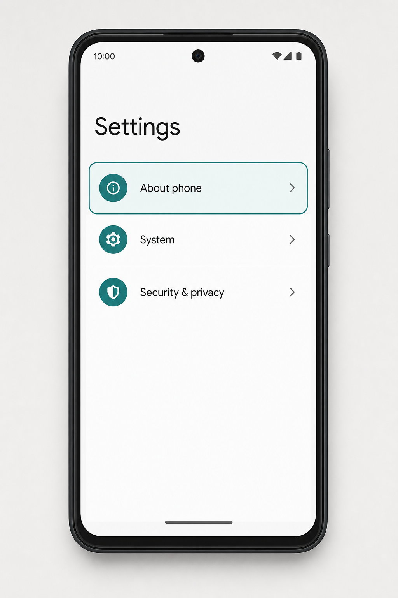
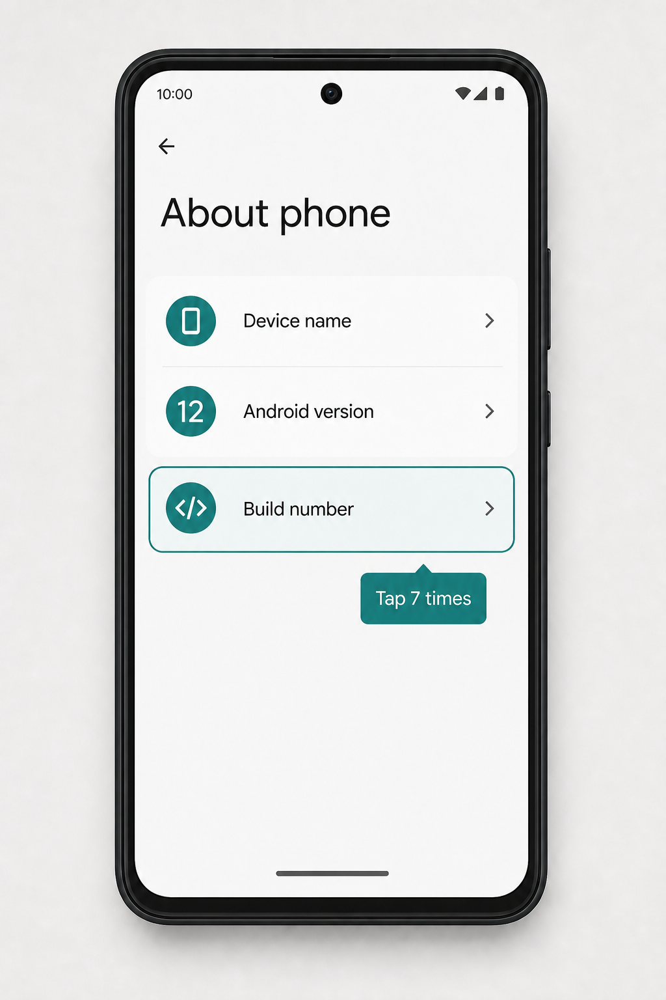
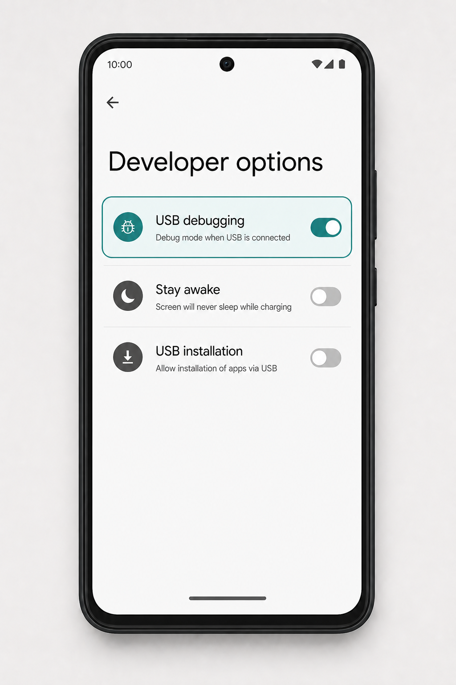
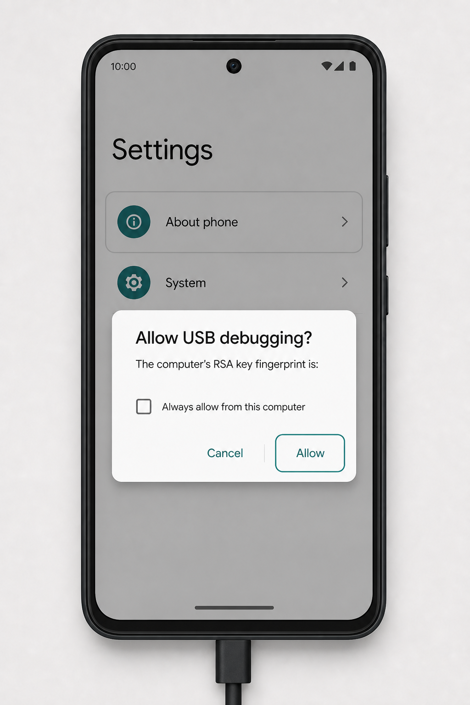

# JA ADB Tool User Guide

Version: **1.11.0**

### Highlights in v1.11.0

- **Smart Upload Engine & Dedicated 1-Click Upload Buttons:** Direct toolbar buttons for **Upload Files** and **Upload Folder** provide immediate (0ms) visual spinner feedback while the native Windows File Picker initializes. Batch folder directory tree planning runs asynchronously without UI freezes.
- **Intelligent Conflict Resolution & Live Progress Tracking:** When uploaded files already exist on Android, `UploadConflictDialog` presents clear resolution options: Overwrite, Skip, or Auto Rename (`name (1).ext`), with an "Apply to all remaining conflicts" toggle. The dedicated `UploadProgressDialog` displays live progress percentages, data transfer rates, file counts, and overall status with safe cancellation support.
- **Daemon Responsiveness & ADB Query Hardening:** Completely terminates the 5-second background query spam when device media is empty by caching results cleanly, and removes unsupported `--limit` flags. Create Folder provides instant loading feedback, supports Enter key confirmation, and displays multilingual success toasts.

### Highlights in v1.10.2

- **App Name Title & Company Metadata Polish:** Formal application name "JA ADB Tool" is unified across both Flutter (`MaterialApp.title`) and native Win32 window creation (`window.Create`), ensuring seamless title display across the Windows Taskbar, Alt+Tab, Task Manager, and thumbnail previews. Executable metadata in `Runner.rc` now includes polished `CompanyName` ("JA Tech") and `LegalCopyright` ("Copyright (C) 2026 JA Tech. All rights reserved.").

### Highlights in v1.10.1

- **Native Window Title & Windows Metadata Display:** Formal application name "JA ADB Tool" now displays cleanly across the Windows Taskbar, Alt+Tab app switcher, Task Manager processes list, and hover preview tooltips instead of the internal executable name `ja_adb_tool`. Binary metadata in `Runner.rc` (`FileDescription`, `ProductName`, `InternalName`) is fully synchronized with official brand standards.
- **Header Device Tab Bar Layout Hardening:** Guarded the `no_device_connected` label with `Flexible` and text ellipsis in `DeviceHorizontalTabBar`, eliminating intermediate 4.4px RenderFlex overflow during sidebar toggle animations at 1280x800 resolution.

### Highlights in v1.10.0

- **Flutter Desktop Power & GPU Optimizer:** Centralized `AppPowerManager` and `AppPowerGate` engine monitors application window state (visible, hidden, inactive, minimized, occluded) and automatically suspends animations and polling tickers to drop CPU and GPU rendering overhead to near zero when unfocused or hidden. Integrates seamless animation phase preservation and direction memory for Bento Glass components (`MeshOrb`, `WaveIndicator`), marquee session guards, and an intelligent 12-second Idle Sleep mode.
- **Screen Rotation Toggle:** 1-click screen rotation button added to Quick Tools and Screen Mirror controls, allowing instant rotation cycle (`0° -> 90° -> 180° -> 270°`) via ADB shell `user_rotation` settings.
- **Scrcpy Mirror Space Maximization:** Compact 240px configuration sidebar (expanded embedded mirror display by 80px), clean 1-column option checkboxes, and 11px compact profile dropdown styling.
- **Occlusion-Protected Floating Toasts:** Constrained maximum toast notification width (420px) preventing intrusive occlusion over embedded native Scrcpy DirectX/SDL2 windows.

### Highlights in v1.9.0

- **Split APK & XAPK Cloner Engine:** Support cloning both monolithic APK and modern split APK sets packaged as `.xapk`. Automatically extracts packages, modifies base APK manifests and package identifiers, rewrites split APK configurations, and preserves/pushes OBB expansion assets (`Android/obb/<new_package>/`).
- **Archive Safety & Background Isolates:** File extraction and decompression run in background workers (`Isolate.run` / `compute`) with strict limits (up to 1 GB compressed, 2 GB expanded, 512 entries) preventing ZIP slip and UI freezing.
- **Automated App List Refresh:** Device installed app lists (`logic.loadApps()`) refresh automatically following any successful app cloning, batch installation, or clone profile modification.
- **Brand Identity & Application Icon:** Windows desktop executable displays the official brand icon (Dual Mirror & Clone matrix).
- **Hardened APK Signer Discovery:** Replaced recursive directory climbing with dedicated discovery beside the executable (`bin/uber-apk-signer.jar`) or explicitly specified paths.

### Highlights in v1.8.3

- **APK Signing Setup & Custom Keystore Studio:** Configure custom keystores (`.jks`/`.keystore`), key alias, and passwords directly in App Cloner. Auto-detect `apksigner` and `zipalign` from Android SDK Build-Tools, test signature validity with 1 click, and resolve missing signing tools via in-context action buttons.
- **Multi-Generation ADB Time Sync Engine:** Host clock synchronization supporting Android 5.1 through Android 14+. Uses `cmd alarm set-time` on Android 8.0+ (avoiding kernel `CAP_SYS_TIME` permission blocks on production builds), eliminates the legacy Android 5.1/toolbox Epoch 0 reset bug with a 4-tier fallback command chain, and accurately calculates clock drift across both ISO and Linux date string formats.
- **Horizontal Device Tab Bar:** Connected Android devices are displayed as sleek horizontal tabs directly in the central header. Supports 1-click device switching, mouse-wheel horizontal scrolling on hover, elastic bounce overflow nudge hints (`Curves.elasticOut`), and animated marquee bounce chevrons.
- **Hardened Layout Stability:** Optimized padding and constraints to guarantee flawless layout stability at standard 1280x800 resolution without RenderFlex overflow.
- **Hardened App Cloner Engine:** Attribute-aware binary AXML patcher preserving DEX namespaces, relative class name expansion, provider authorities rewrite, and safe label/resource replacements. Enforced 4-byte zipalign and verified APK v2 signatures with clear prerequisite reporting.
- **Responsive Layout Stability:** Resolved horizontal flex/overflow issues in the Connected Device bar and Scrcpy Options panel at 1280x800 resolution across languages and themes.
- **App Cloner Studio (Standalone APK Repackaging & Multi-User Dual Space):**
  - **Standalone APK Cloning:** Pure Dart binary AXML patcher supporting UTF-8/UTF-16LE, changes Package ID and App Label, automatically rewrites Provider Authorities to eliminate `INSTALL_FAILED_CONFLICTING_PROVIDER`, strips old signatures and signs with debug keystore.
  - **Dual Space Multi-User Cloning:** Instantaneous profile cloning via Android Multi-User framework without APK repackaging. Create/remove clone profiles, install apps to dual space, and launch them independently.
  - **Bento Glassmorphic Cloner Dialog:** 2-tab modal with real-time animated progress bars and live execution logs.
- **Adaptive Theme Terminal Logs:** Terminal log panels across App Installer, Folder Sync, and ADB Console automatically adapt background and text colors to the active theme (mint emerald on dark slate for Dark Mode; deep green on light slate for Light Mode) eliminating hardcoded black boxes.
- **Scrcpy Mirror Teardown & Sidebar Stability:** Polished screen mirroring cleanup on disconnect and fixed intermediate sidebar overflow glitches during resize.
- **1-Click Windows Setup Scripts:** Updated `install.bat`, `uninstall.bat`, and `uninstall.ps1` with registry registration and clean portable deployment.

## 1. Connect an Android device

1. Install the USB driver supplied by the device manufacturer (or Google USB Driver).
2. Enable **Developer options → USB debugging** on the Android device.
3. Connect the device by USB and approve the RSA authorization prompt.
4. Select the device from the sidebar and use **Refresh** if it does not appear immediately.

For a Wi-Fi connection, open the sidebar **Wireless ADB** action, enter the device IP and port (normally `5555`), and select **Connect**. Saved endpoints can be reused from the same dialog. **Diagnostics** checks the local tools and active device; **Device Workspaces** stores the paths, endpoint, and sync folders needed to return to a known setup.

When no device is connected, JA ADB Tool shows the same setup as a four-step illustrated guide. The images are neutral Android-style examples; labels can differ by phone brand. Click any image in the app to open a zoomable preview.

## 2. Mirror the device screen

Open **Screen Mirror**, choose the desired Scrcpy options, and select **Launch Mirroring**. Save a named **Scrcpy Profile** beside the options to reuse a presentation, testing, or read-only setup. The bundled Scrcpy runtime is used by the Windows portable build.

## 3. Manage files

Use **File Explorer** to browse Android storage.
- **Upload:** Use the dedicated 1-click **Upload Files** or **Upload Folder** buttons in the toolbar. The Smart Upload Engine scans directory trees asynchronously, checks for destination conflicts on Android, presents the conflict resolution modal (Overwrite, Skip, or Auto Rename), and displays live transfer progress and speed.
- **Folder Creation:** Click **Create Folder** and press `Enter` to confirm instantly. The app shows immediate spinner feedback and a confirmation toast upon directory creation.
- **Download & Batch Operations:** Select items to download or delete. Batch operations show progress and transfer speed where available.

Open **App Manager** to search installed packages. Select multiple visible apps with the checkboxes, then use the batch action button to freeze, unfreeze, force-stop, or uninstall them. Uninstall requires an explicit confirmation and reports successes and failures separately.

## 4. Safe Sync v2

1. Open **Folder Sync** and choose a PC folder, Android folder, and direction.
2. Choose normal synchronization to copy/update files, or enable **Mirror Sync** to remove files that exist only on the target.
3. Select **Start Sync**. The app first displays a diff preview with copy/update/delete counts and the exact delete paths.
4. Review the preview. If deletions are present, type `DELETE` exactly in the confirmation field and select **Start Sync**.
5. If either folder changes after the preview, the operation stops safely and asks you to review a fresh diff.
6. During a long sync, use **Pause** to hold before the next file and **Resume** to continue. **Cancel** leaves the completed actions in the log.

Auto-sync is disabled while Mirror Sync is selected so a destructive operation cannot run without an explicit preview confirmation.

## 5. Install APK/XAPK

Open **App Installer** and select one or more APK/XAPK files in the picker. On a desktop window the installer uses two columns: the left side contains the picker and compact package queue; the right side shows details for a single selected package, the installation log, and actions. Review the queue, remove an item if needed, then install the packages sequentially. The log expands to use available height and remains scrollable for long output. XAPK archives are checked for unsafe paths, symlinks, excessive entry counts, and oversized content before extraction.

## 6. App Cloner Studio (Standalone APK Cloning & Multi-User Dual Space)

JA ADB Tool introduces **App Cloner Studio**, an all-in-one suite for running multiple instances of Android applications simultaneously:

### Mode A: Standalone APK Cloning
- **Pure-Dart Binary AXML Engine:** Directly parses and rewrites Android's binary XML format (`AndroidManifest.xml`) at high speed without needing external smali or apktool wrappers.
- **Package ID & Label Customization:** Specify a new unique Package ID (e.g. `com.example.app.clone1`) and customizable display name.
- **Provider Authorities Auto-Rewrite:** Scans and updates ContentProvider authority definitions matching the original package name to completely eliminate the Android `INSTALL_FAILED_CONFLICTING_PROVIDER` installation failure.
- **Automatic Signature & Re-packing:** Strips obsolete manufacturer/store signatures (`META-INF`), repacks the APK using ZIP deflate compression, and auto-signs the APK using host JDK `jarsigner` / `keytool` (auto-generating a standard Android debug keystore if absent).
- **Direct Install or Export:** Choose whether to automatically install the cloned app onto the connected device immediately or export the APK to a custom local directory.

### Mode B: Dual Space Multi-User Cloning
- **Native Android Multi-User Framework:** Leverages Android's built-in multi-user framework (`pm create-user`, `pm install-existing`) to clone apps instantly without modifying or repacking any APK files.
- **Profile Management:** View all user profiles on the device, create dedicated Clone Space profiles with 1 click, and delete unused profiles cleanly.
- **Instant App Cloning:** Select any installed app and install it into your Dual Space profile instantaneously.
- **Independent Execution:** Launch and control cloned apps directly within their isolated user space (`am start --user <id>`).

### Quick Access Entry Points
- **App Manager:** Click the **Clone App** button in the App Inspector panel or select **Clone App** in the 3-dots popup menu.
- **App Installer:** Click **Clone APK** in the Package Inspector side panel when inspecting any APK.
- **Quick Tools:** Click the **App Cloner Studio** shortcut tile.
- **Command Palette:** Press `Ctrl+K` and choose **App Cloner Studio**.

## 7. Latest Media and Quick Tools

Use **Latest Media** to review recent photos/videos. The list is preloaded in the background after device discovery and cached per device, so opening the tab or switching between devices is immediate. Use the refresh button when you need a fresh query. **Quick Tools** provides text input, key simulation, reboot controls, screenshots, and other common ADB actions.

## 8. Reverse tethering

JA ADB Tool bundles the Rust-based `gnirehtet` utility to share your PC's internet connection with your Android device via USB:

1. Under **Paths Settings**, verify or configure the `gnirehtet.exe` path (bundled under `bin/gnirehtet-rust-win64/`).
2. Select **Start Reverse Tethering**. The app automatically:
   - Scans and locates `gnirehtet.apk` in all embedded and adjacent directories.
   - Inspects the connected Android device via ADB (`pm path com.genymobile.gnirehtet`). If the client app is not present, it installs it automatically.
   - Configures execution variables (`GNIREHTET_APK`, `ADB`, system `PATH`) and working directory to avoid "No such file or directory" errors.
3. Unlock your Android device and approve the VPN connection prompt displayed by Android.

## 9. Bento Liquid Glass UI, Themes, and Settings

JA ADB Tool v1.7.4 refines the **Bento Liquid Glass Design System**:

- **Bento & Mesh Background:** GPU-accelerated translucent glass cards with glowing accents, subtle borders, and smooth hover animations.
- **Dynamic Island Capsule:** A pill-shaped status indicator in the top header displaying real-time device connection and mirroring status (`CONNECTED`, `MIRROR`, `REVERSE`, `STANDBY`).
- **3-Tier Responsive Adaptive Navigation (`SlidingPillTabBar`):**
  - **Tier 1 (Wide):** Displays full tab icons and localized labels.
  - **Tier 2 (Medium / Vietnamese Mode):** Automatically hides redundant icons to prioritize text labels so all 7 tabs fit seamlessly without hiding the last tab.
  - **Tier 3 (Compact Dock):** Expands the active tab while collapsing unselected tabs to icon capsules with hover tooltips.
  - **Elastic Bounce Nudge Hint:** Uses `Curves.elasticOut` on tab list changes to visually indicate horizontal scrollability.
  - **Mouse Wheel & Navigation Chevrons:** Allows horizontal scrolling via desktop mouse wheel and glass indicator chevrons.
- **Asymmetric Marquee Text:** Automatically provides ping-pong edge-pausing text scrolling for long device model names, serial subtitles, and version stamps without text truncation.
- **Unified Sidebar Footer:** The bottom-left toolbar groups all system utilities:
  - ⚙️ **Settings (Paths, Glassmorphism, Backup/Restore)**
  - 🌓 **1-Click Theme Toggle** (Instant Dark/Light switching with Windows DWM title bar synchronization)
  - 🌐 **Language Switcher** (`EN` / `VI` / `ZH`)
  - ⌨️ **Command Palette** (`Ctrl+K`)

- **Reusable glass widgets:** Animated borders safely ignore invalid empty/zero-size paint inputs; GlassDropdown supports fast search and single/multi-selection.

Open **Settings** from the sidebar footer. The dialog contains three top-level tabs — **Advanced Settings** (default), **About**, and **User Guide** — without opening child dialogs. Tool Paths is collapsed by default; expand it only when you need to change ADB, Scrcpy, or Gnirehtet locations. The selected app language is saved and restored on the next launch. The **Glassmorphism** section in Advanced Settings includes a live preview and four sliders:

- Main background blur and opacity
- Dialog blur and opacity

Slider changes remain local until **Save** is pressed. **Default** restores the factory values (10px / 60% for the main background and 12px / 75% for dialogs); **Cancel** discards the preview. When a surface is translucent, the preview keeps a minimum 6px blur to preserve text legibility.

Press **Ctrl+K** anywhere in the main window to open the **Command Palette**. It provides quick access to tabs, Wireless ADB, Diagnostics, Workspaces, Backup/Restore, update checks, and the Plugin Manager. Backup/Restore exports only safe settings to a schema-validated JSON file. The update checker opens the official GitHub release page; it does not download or replace the app automatically. Plugin Manager reads trusted JSON manifests from `%APPDATA%\JA ADB Tool\plugins` and never executes a manifest entry point.

## 10. Troubleshooting

- If no device appears, verify USB debugging, the cable, the OEM driver, and `adb devices` authorization.
- If Scrcpy or Gnirehtet cannot start, check their paths under **Paths Settings**.
- If Safe Sync stops after the preview, review the changed folders and run a new preview instead of retrying a stale diff.
- Runtime settings are stored in `config.json` beside the portable executable (or in the current working directory during development). If that location is read-only, the selected language is stored under `%APPDATA%\\JA ADB Tool` instead.

## 11. Diagnostic debug mode

Run `debug.bat` from the portable folder when you need diagnostics. It passes `-debug` to the executable. The app then shows a `DEBUG · v<version> (<build time>)` badge, writes full ISO-8601 timestamps to the log/console, and keeps the build timestamp fixed to the compiled artifact time. A normal launch through `ja_adb_tool.exe` does not show the badge.

## 12. LAN Over-The-Air (OTA) Updates

JA ADB Tool features an integrated OTA updating mechanism designed for private local area networks (LAN) and factory/intranet environments where public internet access is restricted or unavailable.

### Configuring LAN OTA Update
1. Open **Settings** (`⚙️`) from the bottom-left sidebar toolbar and navigate to the **LAN OTA Update** tab.
2. In **Update Server Path**, enter the shared folder hosting your releases. Both local drives (e.g. `D:\Releases\JA_adb_tool`) and UNC SMB network shares (e.g. `\\192.168.1.100\Shared\JA_adb_tool`) are supported.
3. If the network share requires authentication, supply the **Username** (or `DOMAIN\User`) and **Password**. JA ADB Tool securely mounts the network path via `net use`.
4. Choose an **Auto-Check Interval** (Startup Only, Every 1 Hour, Every 4 Hours, Every 12 Hours, or Daily).
5. Click **Test Connection** to verify read access and locate available update packages.

### Checking and Applying Updates
- **Automatic Check:** If configured, the app checks the LAN update server in the background 3 seconds after startup.
- **Manual Check:** Click **Check Now** in the LAN OTA Update settings tab or press `Ctrl+K` and run **Check for Updates**.
- When an update is detected, a **Bento Frosted Glass Update Dialog** displays the new version, release date, package size, and markdown-formatted release notes.
- Click **Update Now** to initiate atomic package extraction to a temporary staging folder with real-time transfer progress and SHA256 integrity verification.
- Once staged and validated, click **Restart & Apply** to execute `apply_update.bat`. The updater safely waits for the app to exit, syncs files via `robocopy`, backs up the old version, and automatically relaunches JA ADB Tool.

## 13. Windows Installer & Uninstaller Suite

JA ADB Tool provides a zero-dependency, user-space Windows installer and uninstaller suite conforming to the `dart-build-pro` standard:

### 1-Click Installation (`install.bat`)
- **No Admin Rights Required (Zero UAC):** Installs cleanly into `%LOCALAPPDATA%\Programs\JA_adb_tool` without requiring administrator elevation.
- **Shortcuts & Registration:** Creates **Desktop** (`JA ADB Tool.lnk`), **Start Menu** (`Programs \ JA ADB Tool`), and registers in **Windows Settings / Control Panel** (`Installed apps`) with accurate file size and version metadata.
- **Data Preservation:** Backs up existing files to `%TEMP%` and preserves your runtime configurations (`config.json`, `update_config.json`, logs) during re-installation or upgrades.
- **Silent Deployment:** Run `install.bat /silent` (or `/s`) for unattended batch installations across enterprise workstations.

### Safe Uninstallation (`uninstall.bat` & `uninstall.ps1`)
- **Staging Self-Execution:** Copies itself to `%TEMP%` before running to avoid Windows file-locking on batch files.
- **Clean Removal:** Terminates any active JA ADB Tool process, deletes program files, cleans Desktop and Start Menu shortcuts, and removes the Windows Registry uninstall key.
- **Data Choice:** Prompts whether to keep or purge user configuration and log files. In silent mode (`uninstall.bat /silent`), configurations are safely preserved by default.

## 14. Screen Mirroring (Scrcpy) Stability & Quality Presets

JA ADB Tool features an embedded screen mirroring suite backed by Scrcpy and DirectX/SDL2 native Win32 window parenting:

### Video Quality Presets
Select between 3 purpose-built presets to match your connection type:
- **Low / Wi-Fi (`1024px • 30fps • 3Mbps`):** Designed for wireless debugging and congested Wi-Fi bands. Prioritizes lowest input-to-display latency with minimal network overhead.
- **Balanced (`1600px • 60fps • 6Mbps`):** Default recommended preset. Delivers fluid 60 FPS motion and sharp text rendering for daily development and testing.
- **High / USB (`1920px • 60fps • 10Mbps`):** Full HD resolution with high-bitrate video stream over USB cables. Ideal for UI inspection and presentation recording.

### Session Management & Diagnostics
- **Session Tracking & Pinned Device:** Mirroring captures the target device's serial at launch time (`_mirroringDeviceSerial`) for CLI arguments and diagnostics. Switching the active device dropdown in the toolbar will safely stop the ongoing mirror session.
- **State Machine:** Real-time state indicators (`starting`, `running`, `stopping`, `error`) with animated feedback on the primary launch button and preview placeholder.
- **Bounded Startup Retries:** Prevents recursive startup loops on transient ADB disconnects, with actionable error toasts derived from Scrcpy stderr logs.
- **Smooth Layout Resizing & Maximized Display Space:** In-flight message throttling prevents Win32 `MethodChannel` congestion during fast window resizing. The options sidebar is streamlined to 240px with a clean single-column checkbox list, dedicating 80px more horizontal space to the embedded display.
- **Screen Rotation Control:** Integrated button allows cycling screen orientation (0°, 90°, 180°, 270°) instantly via ADB shell `user_rotation`.

## 15. Desktop Power & GPU Optimization

JA ADB Tool includes an intelligent, centralized power management subsystem (`AppPowerManager` & `AppPowerGate`):

- **Window State Monitoring:** Intercepts native Windows messages (`WM_ACTIVATE`, `WM_SYSCOMMAND SC_MINIMIZE/SC_RESTORE`, `WM_WINDOWPOSCHANGED`) to detect when the application is minimized, hidden behind another window, or placed in the background.
- **Dynamic Animation Throttling:** Non-essential animations, liquid glass effects, and UI refresh tickers are automatically suspended when the app is obscured or minimized, reducing CPU and GPU utilization to near zero.
- **Phase & Direction Continuity:** When the window is restored or focused, Bento Glass mesh orbs and wave indicators resume from their exact previous rotational phase and direction without visual stutter.
- **Intelligent Idle Sleep:** After 12 seconds of inactivity, UI tickers enter a low-power idle sleep state. Moving the mouse or pressing any key restores full 60fps rendering instantaneously.
- **Customizable Power Settings:** Access power management controls in **Settings (`⚙️`) → Power & Performance** to configure idle timeouts, toggle sleep modes, or lock continuous rendering.

